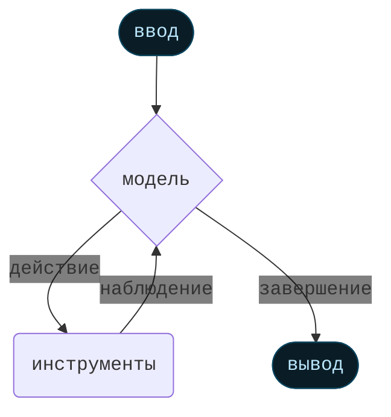

# Агенты

Агенты объединяют языковые модели с [инструментами](/oss/python/langchain/tools) для создания систем, которые могут рассуждать о задачах, решать, какие инструменты использовать, и итеративно работать над решениями.

[`create_agent`](https://reference.langchain.com/python/langchain/agents/#langchain.agents.create_agent) предоставляет готовую к производству реализацию агента.

[Агент LLM запускает инструменты в цикле для достижения цели](https://simonwillison.net/2025/Sep/18/agents/).
Агент работает до тех пор, пока не будет выполнено условие остановки - т.е., когда модель выдает окончательный вывод или достигнут лимит итераций.



<Info>
  [`create_agent`](https://reference.langchain.com/python/langchain/agents/#langchain.agents.create_agent) создает **граф**-основанную среду выполнения агента с использованием [LangGraph](/oss/python/langgraph/overview). Граф состоит из узлов (шагов) и ребер (связей), которые определяют, как ваш агент обрабатывает информацию. Агент перемещается по этому графу, выполняя узлы, такие как узел модели (который вызывает модель), узел инструментов (который выполняет инструменты) или промежуточное ПО.

  Узнайте больше о [Graph API](/oss/python/langgraph/graph-api).
</Info>

## Основные компоненты

### Модель

[Модель](/oss/python/langchain/models) является движком рассуждения вашего агента. Она может быть указана несколькими способами, поддерживая как статический, так и динамический выбор модели.

#### Статическая модель

Статические модели настраиваются один раз при создании агента и остаются неизменными на протяжении всего выполнения. Это самый распространенный и простой подход.

Для инициализации статической модели из <Tooltip tip="Строка, которая следует формату `provider:model` (например, openai:gpt-5)" cta="См. сопоставления" href="https://reference.langchain.com/python/langchain/models/#langchain.chat_models.init_chat_model(model)">строки идентификатора модели</Tooltip>:

```python wrap theme={null}
from langchain.agents import create_agent

agent = create_agent(
    "gpt-5",
    tools=tools
)
```

<Tip>
  Строки идентификаторов моделей поддерживают автоматический вывод (например, `"gpt-5"` будет выведен как `"openai:gpt-5"`). Обратитесь к [справочнику](https://reference.langchain.com/python/langchain/models/#langchain.chat_models.init_chat_model\(model\)) для просмотра полного списка сопоставлений строк идентификаторов моделей.
</Tip>

Для большего контроля над конфигурацией модели инициализируйте экземпляр модели напрямую с помощью пакета провайдера. В этом примере мы используем [`ChatOpenAI`](https://reference.langchain.com/python/integrations/langchain_openai/ChatOpenAI). См. [Модели чата](/oss/python/integrations/chat) для других доступных классов моделей чата.

```python wrap theme={null}
from langchain.agents import create_agent
from langchain_openai import ChatOpenAI

model = ChatOpenAI(
    model="gpt-5",
    temperature=0.1,
    max_tokens=1000,
    timeout=30
    # ... (другие параметры)
)
agent = create_agent(model, tools=tools)
```

Экземпляры моделей дают вам полный контроль над конфигурацией. Используйте их, когда вам нужно установить определенные [параметры](/oss/python/langchain/models#parameters), такие как `temperature`, `max_tokens`, `timeouts`, `base_url` и другие специфичные для провайдера настройки. Обратитесь к [справочнику](/oss/python/integrations/providers/all_providers) для просмотра доступных параметров и методов вашей модели.

#### Динамическая модель

Динамические модели выбираются во <Tooltip tip="Среда выполнения вашего агента, содержащая неизменяемую конфигурацию и контекстные данные, которые сохраняются на протяжении выполнения агента (например, ID пользователей, детали сессии или специфичная для приложения конфигурация).">время выполнения</Tooltip> на основе текущего <Tooltip tip="Данные, которые проходят через выполнение вашего агента, включая сообщения, пользовательские поля и любую информацию, которая должна отслеживаться и потенциально изменяться во время обработки (например, пользовательские предпочтения или статистика использования инструментов).">состояния</Tooltip> и контекста. Это позволяет использовать сложную логику маршрутизации и оптимизацию затрат.

Чтобы использовать динамическую модель, создайте промежуточное ПО, используя декоратор [`@wrap_model_call`](https://reference.langchain.com/python/langchain/middleware/#langchain.agents.middleware.wrap_model_call), который изменяет модель в запросе:

```python  theme={null}
from langchain_openai import ChatOpenAI
from langchain.agents import create_agent
from langchain.agents.middleware import wrap_model_call, ModelRequest, ModelResponse


basic_model = ChatOpenAI(model="gpt-4o-mini")
advanced_model = ChatOpenAI(model="gpt-4o")

@wrap_model_call
def dynamic_model_selection(request: ModelRequest, handler) -> ModelResponse:
    """Выбор модели на основе сложности разговора."""
    message_count = len(request.state["messages"])

    if message_count > 10:
        # Использовать продвинутую модель для длинных разговоров
        model = advanced_model
    else:
        model = basic_model

    return handler(request.override(model=model))

agent = create_agent(
    model=basic_model,  # Модель по умолчанию
    tools=tools,
    middleware=[dynamic_model_selection]
)
```

<Warning>
  Предварительно связанные модели (модели с уже вызванным [`bind_tools`](https://reference.langchain.com/python/langchain_core/language_models/#langchain_core.language_models.chat_models.BaseChatModel.bind_tools)) не поддерживаются при использовании структурированного вывода. Если вам нужен динамический выбор модели со структурированным выводом, убедитесь, что модели, передаваемые в промежуточное ПО, не предварительно связаны.
</Warning>

<Tip>
  Для деталей конфигурации модели см. [Модели](/oss/python/langchain/models). Для шаблонов динамического выбора модели см. [Динамическая модель в промежуточном ПО](/oss/python/langchain/middleware#dynamic-model).
</Tip>

### Инструменты

Инструменты дают агентам возможность выполнять действия. Агенты выходят за рамки простой привязки инструментов только к модели, обеспечивая:

* Последовательные вызовы нескольких инструментов (запущенные одним запросом)
* Параллельные вызовы инструментов, когда это уместно
* Динамический выбор инструментов на основе предыдущих результатов
* Логика повтора инструментов и обработка ошибок
* Сохранение состояния между вызовами инструментов

Для получения дополнительной информации см. [Инструменты](/oss/python/langchain/tools).

#### Определение инструментов

Передайте список инструментов агенту.

<Tip>
  Инструменты могут быть указаны как простые функции Python или <Tooltip tip="Метод, который может приостанавливать выполнение и возобновлять его позже">корутины</Tooltip>.

  [Декоратор инструмента](/oss/python/langchain/tools#create-tools) может использоваться для настройки имен инструментов, описаний, схем аргументов и других свойств.
</Tip>

```python wrap theme={null}
from langchain.tools import tool
from langchain.agents import create_agent


@tool
def search(query: str) -> str:
    """Поиск информации."""
    return f"Результаты для: {query}"

@tool
def get_weather(location: str) -> str:
    """Получить информацию о погоде для местоположения."""
    return f"Погода в {location}: Солнечно, 72°F"

agent = create_agent(model, tools=[search, get_weather])
```

Если предоставлен пустой список инструментов, агент будет состоять из одного узла LLM без возможностей вызова инструментов.

#### Обработка ошибок инструментов

Чтобы настроить обработку ошибок инструментов, используйте декоратор [`@wrap_tool_call`](https://reference.langchain.com/python/langchain/middleware/#langchain.agents.middleware.wrap_tool_call) для создания промежуточного ПО:

```python wrap theme={null}
from langchain.agents import create_agent
from langchain.agents.middleware import wrap_tool_call
from langchain.messages import ToolMessage


@wrap_tool_call
def handle_tool_errors(request, handler):
    """Обработка ошибок выполнения инструментов с пользовательскими сообщениями."""
    try:
        return handler(request)
    except Exception as e:
        # Вернуть пользовательское сообщение об ошибке модели
        return ToolMessage(
            content=f"Ошибка инструмента: Пожалуйста, проверьте ввод и попробуйте снова. ({str(e)})",
            tool_call_id=request.tool_call["id"]
        )

agent = create_agent(
    model="gpt-4o",
    tools=[search, get_weather],
    middleware=[handle_tool_errors]
)
```

Агент вернет [`ToolMessage`](https://reference.langchain.com/python/langchain/messages/#langchain.messages.ToolMessage) с пользовательским сообщением об ошибке, когда инструмент не сработает:

```python  theme={null}
[
    ...
    ToolMessage(
        content="Ошибка инструмента: Пожалуйста, проверьте ввод и попробуйте снова. (деление на ноль)",
        tool_call_id="..."
    ),
    ...
]
```

#### Использование инструментов в цикле ReAct

Агенты следуют шаблону ReAct ("Рассуждение + Действие"), чередуя краткие шаги рассуждения с целенаправленными вызовами инструментов и передавая полученные наблюдения в последующие решения до тех пор, пока не смогут дать окончательный ответ.

<Accordion title="Пример цикла ReAct">
  **Запрос:** Определить самые популярные беспроводные наушники и проверить наличие.

  ```
  ================================ Сообщение человека =================================

  Найдите самые популярные беспроводные наушники прямо сейчас и проверьте, есть ли они в наличии
  ```

  * **Рассуждение**: "Популярность зависит от времени, мне нужно использовать предоставленный инструмент поиска."
  * **Действие**: Вызов `search_products("беспроводные наушники")`

  ```
  ================================== Сообщение ИИ ==================================
  Вызовы инструментов:
    search_products (call_abc123)
   ID вызова: call_abc123
    Аргументы:
      query: беспроводные наушники
  ```

  ```
  ================================= Сообщение инструмента =================================

  Найдено 5 продуктов, соответствующих "беспроводные наушники". Топ 5 результатов: WH-1000XM5, ...
  ```

  * **Рассуждение**: "Мне нужно подтвердить наличие самого популярного товара перед ответом."
  * **Действие**: Вызов `check_inventory("WH-1000XM5")`

  ```
  ================================== Сообщение ИИ ==================================
  Вызовы инструментов:
    check_inventory (call_def456)
   ID вызова: call_def456
    Аргументы:
      product_id: WH-1000XM5
  ```

  ```
  ================================= Сообщение инструмента =================================

  Продукт WH-1000XM5: 10 единиц в наличии
  ```

  * **Рассуждение**: "У меня есть самая популярная модель и статус ее наличия. Теперь я могу ответить на вопрос пользователя."
  * **Действие**: Создание окончательного ответа

  ```
  ================================== Сообщение ИИ ==================================

  Я нашел беспроводные наушники (модель WH-1000XM5) с 10 единицами в наличии...
  ```
</Accordion>

<Tip>
  Чтобы узнать больше об инструментах, см. [Инструменты](/oss/python/langchain/tools).
</Tip>

### Системная подсказка

Вы можете формировать подход вашего агента к задачам, предоставляя подсказку. Параметр [`system_prompt`](https://reference.langchain.com/python/langchain/agents/#langchain.agents.create_agent\(system_prompt\)) может быть предоставлен в виде строки:

```python wrap theme={null}
agent = create_agent(
    model,
    tools,
    system_prompt="Вы полезный помощник. Будьте кратки и точны."
)
```

Когда [`system_prompt`](https://reference.langchain.com/python/langchain/agents/#langchain.agents.create_agent\(system_prompt\)) не предоставлен, агент будет выводить свою задачу непосредственно из сообщений.

#### Динамическая системная подсказка

Для более продвинутых случаев использования, когда вам нужно изменить системную подсказку на основе контекста выполнения или состояния агента, вы можете использовать [промежуточное ПО](/oss/python/langchain/middleware).

Декоратор [`@dynamic_prompt`](https://reference.langchain.com/python/langchain/middleware/#langchain.agents.middleware.dynamic_prompt) создает промежуточное ПО, которое генерирует системные подсказки на основе запроса модели:

```python wrap theme={null}
from typing import TypedDict

from langchain.agents import create_agent
from langchain.agents.middleware import dynamic_prompt, ModelRequest


class Context(TypedDict):
    user_role: str

@dynamic_prompt
def user_role_prompt(request: ModelRequest) -> str:
    """Генерация системной подсказки на основе роли пользователя."""
    user_role = request.runtime.context.get("user_role", "user")
    base_prompt = "Вы полезный помощник."

    if user_role == "expert":
        return f"{base_prompt} Предоставляйте подробные технические ответы."
    elif user_role == "beginner":
        return f"{base_prompt} Объясняйте концепции просто и избегайте жаргона."

    return base_prompt

agent = create_agent(
    model="gpt-4o",
    tools=[web_search],
    middleware=[user_role_prompt],
    context_schema=Context
)

# Системная подсказка будет установлена динамически на основе контекста
result = agent.invoke(
    {"messages": [{"role": "user", "content": "Объясните машинное обучение"}]},
    context={"user_role": "expert"}
)
```

<Tip>
  Для получения дополнительной информации о типах сообщений и форматировании см. [Сообщения](/oss/python/langchain/messages). Для полной документации по промежуточному ПО см. [Промежуточное ПО](/oss/python/langchain/middleware).
</Tip>

## Вызов

Вы можете вызвать агента, передав обновление его [`State`](/oss/python/langgraph/graph-api#state). Все агенты включают [последовательность сообщений](/oss/python/langgraph/use-graph-api#messagesstate) в своем состоянии; чтобы вызвать агента, передайте новое сообщение:

```python  theme={null}
result = agent.invoke(
    {"messages": [{"role": "user", "content": "Какая погода в Сан-Франциско?"}]}
)
```

Для потоковой передачи шагов и/или токенов от агента обратитесь к руководству [потоковая передача](/oss/python/langchain/streaming).

В противном случае агент следует [Graph API](/oss/python/langgraph/use-graph-api) LangGraph и поддерживает все связанные методы, такие как `stream` и `invoke`.

## Продвинутые концепции

### Структурированный вывод

В некоторых ситуациях вы можете захотеть, чтобы агент возвращал вывод в определенном формате. LangChain предоставляет стратегии для структурированного вывода через параметр `response_format`.

#### ToolStrategy

`ToolStrategy` использует искусственный вызов инструментов для генерации структурированного вывода. Это работает с любой моделью, поддерживающей вызов инструментов:

```python wrap theme={null}
from pydantic import BaseModel
from langchain.agents import create_agent
from langchain.agents.structured_output import ToolStrategy


class ContactInfo(BaseModel):
    name: str
    email: str
    phone: str

agent = create_agent(
    model="gpt-4o-mini",
    tools=[search_tool],
    response_format=ToolStrategy(ContactInfo)
)

result = agent.invoke({
    "messages": [{"role": "user", "content": "Извлеките контактную информацию из: John Doe, john@example.com, (555) 123-4567"}]
})

result["structured_response"]
# ContactInfo(name='John Doe', email='john@example.com', phone='(555) 123-4567')
```

#### ProviderStrategy

`ProviderStrategy` использует собственную генерацию структурированного вывода провайдера модели. Это более надежно, но работает только с провайдерами, поддерживающими собственный структурированный вывод (например, OpenAI):

```python wrap theme={null}
from langchain.agents.structured_output import ProviderStrategy

agent = create_agent(
    model="gpt-4o",
    response_format=ProviderStrategy(ContactInfo)
)
```

<Note>
  Начиная с `langchain 1.0`, просто передача схемы (например, `response_format=ContactInfo`) больше не поддерживается. Вы должны явно использовать `ToolStrategy` или `ProviderStrategy`.
</Note>

<Tip>
  Чтобы узнать о структурированном выводе, см. [Структурированный вывод](/oss/python/langchain/structured-output).
</Tip>

### Память

Агенты автоматически поддерживают историю разговора через состояние сообщений. Вы также можете настроить агента на использование пользовательской схемы состояния для запоминания дополнительной информации во время разговора.

Информация, хранящаяся в состоянии, может рассматриваться как [краткосрочная память](/oss/python/langchain/short-term-memory) агента:

Пользовательские схемы состояния должны расширять [`AgentState`](https://reference.langchain.com/python/langchain/agents/#langchain.agents.AgentState) как `TypedDict`.

Существует два способа определения пользовательского состояния:

1. Через [промежуточное ПО](/oss/python/langchain/middleware) (предпочтительно)
2. Через [`state_schema`](https://reference.langchain.com/python/langchain/middleware/#langchain.agents.middleware.AgentMiddleware.state_schema) в [`create_agent`](https://reference.langchain.com/python/langchain/agents/#langchain.agents.create_agent)

#### Определение состояния через промежуточное ПО

Используйте промежуточное ПО для определения пользовательского состояния, когда ваше пользовательское состояние должно быть доступно для определенных хуков промежуточного ПО и инструментов, прикрепленных к этому промежуточному ПО.

```python  theme={null}
from langchain.agents import AgentState
from langchain.agents.middleware import AgentMiddleware
from typing import Any


class CustomState(AgentState):
    user_preferences: dict

class CustomMiddleware(AgentMiddleware):
    state_schema = CustomState
    tools = [tool1, tool2]

    def before_model(self, state: CustomState, runtime) -> dict[str, Any] | None:
        ...

agent = create_agent(
    model,
    tools=tools,
    middleware=[CustomMiddleware()]
)

# Агент теперь может отслеживать дополнительное состояние помимо сообщений
result = agent.invoke({
    "messages": [{"role": "user", "content": "Я предпочитаю технические объяснения"}],
    "user_preferences": {"style": "technical", "verbosity": "detailed"},
})
```

#### Определение состояния через `state_schema`

Используйте параметр [`state_schema`](https://reference.langchain.com/python/langchain/middleware/#langchain.agents.middleware.AgentMiddleware.state_schema) как ярлык для определения пользовательского состояния, которое используется только в инструментах.

```python  theme={null}
from langchain.agents import AgentState


class CustomState(AgentState):
    user_preferences: dict

agent = create_agent(
    model,
    tools=[tool1, tool2],
    state_schema=CustomState
)
# Агент теперь может отслеживать дополнительное состояние помимо сообщений
result = agent.invoke({
    "messages": [{"role": "user", "content": "Я предпочитаю технические объяснения"}],
    "user_preferences": {"style": "technical", "verbosity": "detailed"},
})
```

<Note>
  Начиная с `langchain 1.0`, пользовательские схемы состояния **должны** быть типами `TypedDict`. Модели Pydantic и dataclass больше не поддерживаются. См. [руководство по миграции v1](/oss/python/migrate/langchain-v1#state-type-restrictions) для получения дополнительной информации.
</Note>

<Note>
  Определение пользовательского состояния через промежуточное ПО предпочтительнее, чем определение его через [`state_schema`](https://reference.langchain.com/python/langchain/middleware/#langchain.agents.middleware.AgentMiddleware.state_schema) в [`create_agent`](https://reference.langchain.com/python/langchain/agents/#langchain.agents.create_agent), потому что это позволяет концептуально ограничить расширения состояния соответствующим промежуточным ПО и инструментами.

  [`state_schema`](https://reference.langchain.com/python/langchain/middleware/#langchain.agents.middleware.AgentMiddleware.state_schema) все еще поддерживается для обратной совместимости в [`create_agent`](https://reference.langchain.com/python/langchain/agents/#langchain.agents.create_agent).
</Note>

<Tip>
  Чтобы узнать больше о памяти, см. [Память](/oss/python/concepts/memory). Для информации о реализации долгосрочной памяти, которая сохраняется между сессиями, см. [Долгосрочная память](/oss/python/langchain/long-term-memory).
</Tip>

### Потоковая передача

Мы видели, как агент может быть вызван с помощью `invoke` для получения окончательного ответа. Если агент выполняет несколько шагов, это может занять некоторое время. Чтобы показать промежуточный прогресс, мы можем передавать сообщения по мере их появления.

```python  theme={null}
for chunk in agent.stream({
    "messages": [{"role": "user", "content": "Поиск новостей ИИ и резюмирование результатов"}]
}, stream_mode="values"):
    # Каждый фрагмент содержит полное состояние на тот момент
    latest_message = chunk["messages"][-1]
    if latest_message.content:
        print(f"Агент: {latest_message.content}")
    elif latest_message.tool_calls:
        print(f"Вызов инструментов: {[tc['name'] for tc in latest_message.tool_calls]}")
```

<Tip>
  Для получения дополнительной информации о потоковой передаче см. [Потоковая передача](/oss/python/langchain/streaming).
</Tip>

### Промежуточное ПО

[Промежуточное ПО](/oss/python/langchain/middleware) обеспечивает мощную расширяемость для настройки поведения агента на разных этапах выполнения. Вы можете использовать промежуточное ПО для:

* Обработки состояния перед вызовом модели (например, обрезка сообщений, внедрение контекста)
* Изменения или проверки ответа модели (например, защитные меры, фильтрация контента)
* Обработки ошибок выполнения инструментов с пользовательской логикой
* Реализации динамического выбора модели на основе состояния или контекста
* Добавления пользовательского логирования, мониторинга или аналитики

Промежуточное ПО интегрируется без проблем в выполнение агента, позволяя перехватывать и изменять поток данных в ключевых точках без изменения основной логики агента.

<Tip>
  Для полной документации по промежуточному ПО, включая декораторы, такие как [`@before_model`](https://reference.langchain.com/python/langchain/middleware/#langchain.agents.middleware.before_model), [`@after_model`](https://reference.langchain.com/python/langchain/middleware/#langchain.agents.middleware.after_model) и [`@wrap_tool_call`](https://reference.langchain.com/python/langchain/middleware/#langchain.agents.middleware.wrap_tool_call), см. [Промежуточное ПО](/oss/python/langchain/middleware).
</Tip>

***

<Callout icon="pen-to-square" iconType="regular">
  [Редактировать источник этой страницы на GitHub.](https://github.com/langchain-ai/docs/edit/main/src/oss/langchain/agents.mdx)
</Callout>

<Tip icon="terminal" iconType="regular">
  [Подключите эти документы программно](/use-these-docs) к Claude, VSCode и другим через MCP для получения ответов в реальном времени.
</Tip>

---
> Чтобы найти навигацию и другие страницы в этой документации, загрузите файл llms.txt по адресу: https://docs.langchain.com/llms.txt
