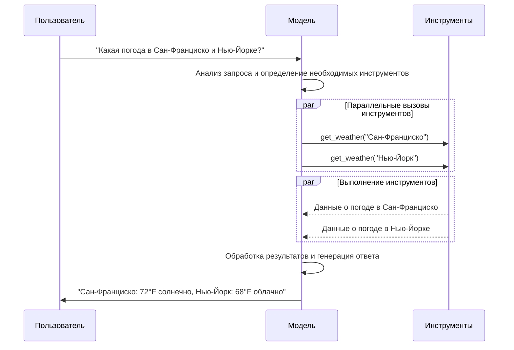

# Модели

[LLM](https://en.wikipedia.org/wiki/Large_language_model) - это мощные ИИ-инструменты, которые могут интерпретировать и генерировать текст, подобно людям. Они достаточно универсальны для написания контента, перевода языков, суммирования и ответов на вопросы без необходимости специализированной подготовки для каждой задачи.

В дополнение к генерации текста многие модели поддерживают:

* <Icon icon="hammer" size={16} /> [Вызов инструментов](#вызов-инструментов) - вызов внешних инструментов (таких как запросы к базам данных или вызовы API) и использование результатов в их ответах.
* <Icon icon="shapes" size={16} /> [Структурированный вывод](#структурированный-вывод) - где ответ модели ограничен следованием определенному формату.
* <Icon icon="image" size={16} /> [Мультимодальность](#мультимодальная) - обработка и возврат данных, отличных от текста, таких как изображения, аудио и видео.
* <Icon icon="brain" size={16} /> [Рассуждение](#рассуждение) - модели выполняют многоступенчатое рассуждение для достижения вывода.

Модели являются движком рассуждения [агентов](/oss/python/langchain/agents). Они управляют процессом принятия решений агента, определяя, какие инструменты вызывать, как интерпретировать результаты и когда давать окончательный ответ.

Качество и возможности выбранной вами модели напрямую влияют на базовую надежность и производительность вашего агента. Разные модели превосходят в разных задачах - некоторые лучше следуют сложным инструкциям, другие лучше структурированному рассуждению, а некоторые поддерживают большие окна контекста для обработки большего объема информации.

Стандартные интерфейсы моделей LangChain дают вам доступ ко многим различным интеграциям поставщиков, что упрощает эксперименты и переключение между моделями для поиска наилучшего решения для вашего варианта использования.

<Info>
  Для получения информации о специфичных для поставщика интеграциях и возможностях см. [страницу чат-модели поставщика](/oss/python/integrations/chat).
</Info>

## Основное использование

Модели можно использовать двумя способами:

1. **С агентами** - Модели можно динамически указывать при создании [агента](/oss/python/langchain/agents#model).
2. **Автономно** - Модели можно вызывать напрямую (вне цикла агента) для задач, таких как генерация текста, классификация или извлечение без необходимости в рамках агента.

Один и тот же интерфейс модели работает в обоих контекстах, что дает вам гибкость начать с простого и масштабироваться до более сложных рабочих процессов на основе агентов по мере необходимости.

### Инициализация модели

Самый простой способ начать работу с автономной моделью в LangChain - использовать [`init_chat_model`](https://reference.langchain.com/python/langchain/models/#langchain.chat_models.init_chat_model) для инициализации из [поставщика чат-модели](/oss/python/integrations/chat) по вашему выбору (примеры ниже):

<Tabs>
  <Tab title="OpenAI">
    👉 Прочитайте [документацию по интеграции чат-модели OpenAI](/oss/python/integrations/chat/openai/)

    ```shell  theme={null}
    pip install -U "langchain[openai]"
    ```

    <CodeGroup>
      ```python init_chat_model theme={null}
      import os
      from langchain.chat_models import init_chat_model

      os.environ["OPENAI_API_KEY"] = "sk-..."

      model = init_chat_model("gpt-4.1")
      ```

      ```python Класс модели theme={null}
      import os
      from langchain_openai import ChatOpenAI

      os.environ["OPENAI_API_KEY"] = "sk-..."

      model = ChatOpenAI(model="gpt-4.1")
      ```
    </CodeGroup>
  </Tab>

  <Tab title="Anthropic">
    👉 Прочитайте [документацию по интеграции чат-модели Anthropic](/oss/python/integrations/chat/anthropic/)

    ```shell  theme={null}
    pip install -U "langchain[anthropic]"
    ```

    <CodeGroup>
      ```python init_chat_model theme={null}
      import os
      from langchain.chat_models import init_chat_model

      os.environ["ANTHROPIC_API_KEY"] = "sk-..."

      model = init_chat_model("claude-sonnet-4-5-20250929")
      ```

      ```python Класс модели theme={null}
      import os
      from langchain_anthropic import ChatAnthropic

      os.environ["ANTHROPIC_API_KEY"] = "sk-..."

      model = ChatAnthropic(model="claude-sonnet-4-5-20250929")
      ```
    </CodeGroup>
  </Tab>

  <Tab title="Azure">
    👉 Прочитайте [документацию по интеграции чат-модели Azure](/oss/python/integrations/chat/azure_chat_openai/)

    ```shell  theme={null}
    pip install -U "langchain[openai]"
    ```

    <CodeGroup>
      ```python init_chat_model theme={null}
      import os
      from langchain.chat_models import init_chat_model

      os.environ["AZURE_OPENAI_API_KEY"] = "..."
      os.environ["AZURE_OPENAI_ENDPOINT"] = "..."
      os.environ["OPENAI_API_VERSION"] = "2025-03-01-preview"

      model = init_chat_model(
          "azure_openai:gpt-4.1",
          azure_deployment=os.environ["AZURE_OPENAI_DEPLOYMENT_NAME"],
      )
      ```

      ```python Класс модели theme={null}
      import os
      from langchain_openai import AzureChatOpenAI

      os.environ["AZURE_OPENAI_API_KEY"] = "..."
      os.environ["AZURE_OPENAI_ENDPOINT"] = "..."
      os.environ["OPENAI_API_VERSION"] = "2025-03-01-preview"

      model = AzureChatOpenAI(
          model="gpt-4.1",
          azure_deployment=os.environ["AZURE_OPENAI_DEPLOYMENT_NAME"]
      )
      ```
    </CodeGroup>
  </Tab>

  <Tab title="Google Gemini">
    👉 Прочитайте [документацию по интеграции чат-модели Google GenAI](/oss/python/integrations/chat/google_generative_ai/)

    ```shell  theme={null}
    pip install -U "langchain[google-genai]"
    ```

    <CodeGroup>
      ```python init_chat_model theme={null}
      import os
      from langchain.chat_models import init_chat_model

      os.environ["GOOGLE_API_KEY"] = "..."

      model = init_chat_model("google_genai:gemini-2.5-flash-lite")
      ```

      ```python Класс модели theme={null}
      import os
      from langchain_google_genai import ChatGoogleGenerativeAI

      os.environ["GOOGLE_API_KEY"] = "..."

      model = ChatGoogleGenerativeAI(model="gemini-2.5-flash-lite")
      ```
    </CodeGroup>
  </Tab>

  <Tab title="AWS Bedrock">
    👉 Прочитайте [документацию по интеграции чат-модели AWS Bedrock](/oss/python/integrations/chat/bedrock/)

    ```shell  theme={null}
    pip install -U "langchain[aws]"
    ```

    <CodeGroup>
      ```python init_chat_model theme={null}
      from langchain.chat_models import init_chat_model

      # Следуйте шагам здесь для настройки ваших учетных данных:
      # https://docs.aws.amazon.com/bedrock/latest/userguide/getting-started.html

      model = init_chat_model(
          "anthropic.claude-3-5-sonnet-20240620-v1:0",
          model_provider="bedrock_converse",
      )
      ```

      ```python Класс модели theme={null}
      from langchain_aws import ChatBedrock

      model = ChatBedrock(model="anthropic.claude-3-5-sonnet-20240620-v1:0")
      ```
    </CodeGroup>

    <Tab title="HuggingFace">
      👉 Прочитайте [документацию по интеграции чат-модели HuggingFace](/oss/python/integrations/chat/huggingface/)

      ```shell  theme={null}
      pip install -U "langchain[huggingface]"
      ```

      <CodeGroup>
        ```python init_chat_model theme={null}
        import os
        from langchain.chat_models import init_chat_model

        os.environ["HUGGINGFACEHUB_API_TOKEN"] = "hf_..."

        model = init_chat_model(
            "microsoft/Phi-3-mini-4k-instruct",
            model_provider="huggingface",
            temperature=0.7,
            max_tokens=1024,
        )
        ```

        ```python Класс модели theme={null}
        import os
        from langchain_huggingface import ChatHuggingFace, HuggingFaceEndpoint

        os.environ["HUGGINGFACEHUB_API_TOKEN"] = "hf_..."

        llm = HuggingFaceEndpoint(
            repo_id="microsoft/Phi-3-mini-4k-instruct",
            temperature=0.7,
            max_length=1024,
        )
        model = ChatHuggingFace(llm=llm)
        ```
      </CodeGroup>
    </Tab>
  </Tab>
</Tabs>

```python  theme={null}
response = model.invoke("Почему попугаи говорят?")
```

Смотрите [`init_chat_model`](https://reference.langchain.com/python/langchain/models/#langchain.chat_models.init_chat_model) для получения более подробной информации, включая информацию о передаче [параметров](#параметры) модели.

### Ключевые методы

<Card title="Invoke" href="#invoke" icon="paper-plane" arrow="true" horizontal>
  Модель принимает сообщения в качестве входных данных и выводит сообщения после генерации полного ответа.
</Card>

<Card title="Stream" href="#stream" icon="tower-broadcast" arrow="true" horizontal>
  Вызовите модель, но передавайте вывод по мере его генерации в реальном времени.
</Card>

<Card title="Batch" href="#batch" icon="grip" arrow="true" horizontal>
  Отправьте несколько запросов к модели в пакете для более эффективной обработки.
</Card>

<Info>
  В дополнение к чат-моделям, LangChain предоставляет поддержку других смежных технологий, таких как модели встраивания и векторные хранилища. Смотрите [страницу интеграций](/oss/python/integrations/providers/overview) для получения подробной информации.
</Info>

## Параметры

Чат-модель принимает параметры, которые можно использовать для настройки ее поведения. Полный набор поддерживаемых параметров зависит от модели и поставщика, но стандартные включают:

<ParamField body="model" type="string" required>
  Имя или идентификатор конкретной модели, которую вы хотите использовать с поставщиком. Вы также можете указать как модель, так и ее поставщика в одном аргументе, используя формат '{model_provider}:{model}', например, 'openai:o1'.
</ParamField>

<ParamField body="api_key" type="string">
  Ключ, необходимый для аутентификации с поставщиком модели. Обычно выдается при регистрации для доступа к модели. Часто доступен путем установки <Tooltip tip="Переменная, значение которой устанавливается вне программы, обычно через функциональность, встроенную в операционную систему или микросервис.">переменной окружения</Tooltip>.
</ParamField>

<ParamField body="temperature" type="number">
  Управляет случайностью вывода модели. Более высокое число делает ответы более креативными; более низкие делают их более детерминированными.
</ParamField>

<ParamField body="max_tokens" type="number">
  Ограничивает общее количество <Tooltip tip="Базовая единица, которую модель читает и генерирует. Поставщики могут определять их по-разному, но в целом они могут представлять целое или часть слова.">токенов</Tooltip> в ответе, эффективно контролируя, насколько длинным может быть вывод.
</ParamField>

<ParamField body="timeout" type="number">
  Максимальное время (в секундах) ожидания ответа от модели перед отменой запроса.
</ParamField>

<ParamField body="max_retries" type="number">
  Максимальное количество попыток, которые система сделает для повторной отправки запроса, если он не удался из-за проблем, таких как сетевые тайм-ауты или ограничения скорости.
</ParamField>

Используя [`init_chat_model`](https://reference.langchain.com/python/langchain/models/#langchain.chat_models.init_chat_model), передавайте эти параметры как встроенные <Tooltip tip="Произвольные аргументы ключевых слов" cta="Узнать больше" href="https://www.w3schools.com/python/python_args_kwargs.asp">`**kwargs`</Tooltip>:

```python Инициализация с использованием параметров модели theme={null}
model = init_chat_model(
    "claude-sonnet-4-5-20250929",
    # Kwargs передаются в модель:
    temperature=0.7,
    timeout=30,
    max_tokens=1000,
)
```

<Info>
  Каждая интеграция чат-модели может иметь дополнительные параметры, используемые для управления функциональностью, специфичной для поставщика.

  Например, [`ChatOpenAI`](https://reference.langchain.com/python/integrations/langchain_openai/ChatOpenAI) имеет `use_responses_api` для указания, использовать ли API OpenAI Responses или Completions.

  Чтобы найти все параметры, поддерживаемые данной чат-моделью, перейдите на [страницу интеграций чат-моделей](/oss/python/integrations/chat).
</Info>

***

## Вызов

Чат-модель должна быть вызвана для генерации вывода. Существует три основных метода вызова, каждый из которых подходит для разных случаев использования.

### Invoke

Самый простой способ вызвать модель - использовать [`invoke()`](https://reference.langchain.com/python/langchain_core/language_models/#langchain_core.language_models.chat_models.BaseChatModel.invoke) с одним сообщением или списком сообщений.

```python Одиночное сообщение theme={null}
response = model.invoke("Почему у попугаев красочные перья?")
print(response)
```

Список сообщений может быть предоставлен чат-модели для представления истории беседы. Каждое сообщение имеет роль, которую модели используют для указания, кто отправил сообщение в беседе.

Смотрите руководство [сообщения](/oss/python/langchain/messages) для получения более подробной информации о ролях, типах и содержании.

```python Формат словаря theme={null}
conversation = [
    {"role": "system", "content": "Вы полезный помощник, который переводит с английского на французский."},
    {"role": "user", "content": "Переведите: I love programming."},
    {"role": "assistant", "content": "J'adore la programmation."},
    {"role": "user", "content": "Переведите: I love building applications."}
]

response = model.invoke(conversation)
print(response)  # AIMessage("J'adore créer des applications.")
```

```python Объекты сообщений theme={null}
from langchain.messages import HumanMessage, AIMessage, SystemMessage

conversation = [
    SystemMessage("Вы полезный помощник, который переводит с английского на французский."),
    HumanMessage("Переведите: I love programming."),
    AIMessage("J'adore la programmation."),
    HumanMessage("Переведите: I love building applications.")
]

response = model.invoke(conversation)
print(response)  # AIMessage("J'adore créer des applications.")
```

<Info>
  Если тип возврата вашего вызова - строка, убедитесь, что вы используете чат-модель, а не LLM. Устаревшие LLM для завершения текста возвращают строки напрямую. Чат-модели LangChain имеют префикс "Chat", например, [`ChatOpenAI`](https://reference.langchain.com/python/integrations/langchain_openai/ChatOpenAI)(/oss/integrations/chat/openai).
</Info>

### Stream

Большинство моделей могут передавать свое содержание вывода во время его генерации. Отображая вывод прогрессивно, потоковая передача значительно улучшает пользовательский опыт, особенно для более длинных ответов.

Вызов [`stream()`](https://reference.langchain.com/python/langchain_core/language_models/#langchain_core.language_models.chat_models.BaseChatModel.stream) возвращает <Tooltip tip="Объект, который прогрессивно предоставляет доступ к каждому элементу коллекции по порядку.">итератор</Tooltip>, который выдает фрагменты вывода по мере их производства. Вы можете использовать цикл для обработки каждого фрагмента в реальном времени:

<CodeGroup>
  ```python Базовая потоковая передача текста theme={null}
  for chunk in model.stream("Почему у попугаев красочные перья?"):
      print(chunk.text, end="|", flush=True)
  ```

  ```python Потоковая передача вызовов инструментов, рассуждений и другого содержания theme={null}
  for chunk in model.stream("Какого цвета небо?"):
      for block in chunk.content_blocks:
          if block["type"] == "reasoning" and (reasoning := block.get("reasoning")):
              print(f"Рассуждение: {reasoning}")
          elif block["type"] == "tool_call_chunk":
              print(f"Фрагмент вызова инструмента: {block}")
          elif block["type"] == "text":
              print(block["text"])
          else:
              ...
  ```
</CodeGroup>

В отличие от [`invoke()`](#invoke), который возвращает одно [`AIMessage`](https://reference.langchain.com/python/langchain/messages/#langchain.messages.AIMessage) после того, как модель закончила генерировать свой полный ответ, `stream()` возвращает несколько объектов [`AIMessageChunk`](https://reference.langchain.com/python/langchain/messages/#langchain.messages.AIMessageChunk), каждый из которых содержит часть выходного текста. Важно отметить, что каждый фрагмент в потоке предназначен для сбора в полное сообщение через суммирование:

```python Создание AIMessage theme={null}
full = None  # None | AIMessageChunk
for chunk in model.stream("Какого цвета небо?"):
    full = chunk if full is None else full + chunk
    print(full.text)

# Небо
# Небо -
# Небо - обычно
# Небо - обычно синее
# ...

print(full.content_blocks)
# [{"type": "text", "text": "Небо обычно синее..."}]
```

Результирующее сообщение можно рассматривать так же, как и сообщение, сгенерированное с помощью [`invoke()`](#invoke) - например, его можно агрегировать в историю сообщений и передать обратно в модель в качестве контекста беседы.

<Warning>
  Потоковая передача работает только в том случае, если все шаги в программе знают, как обрабатывать поток фрагментов. Например, приложение, которое не поддерживает потоковую передачу, будет тем, которое должно хранить весь вывод в памяти перед его обработкой.
</Warning>

<Accordion title="Продвинутые темы потоковой передачи">
  <Accordion title="Потоковая передача событий">
    Чат-модели LangChain также могут передавать семантические события с помощью `astream_events()`.

    Это упрощает фильтрацию на основе типов событий и других метаданных и будет агрегировать полное сообщение в фоновом режиме. Смотрите пример ниже.

    ```python  theme={null}
    async for event in model.astream_events("Привет"):

        if event["event"] == "on_chat_model_start":
            print(f"Ввод: {event['data']['input']}")

        elif event["event"] == "on_chat_model_stream":
            print(f"Токен: {event['data']['chunk'].text}")

        elif event["event"] == "on_chat_model_end":
            print(f"Полное сообщение: {event['data']['output'].text}")

        else:
            pass
    ```

    ```txt  theme={null}
    Ввод: Привет
    Токен: Привет
    Токен: , 
    Токен: как
    Токен: дела
    Токен: ?
    ...
    Полное сообщение: Привет, как дела?
    ```

    <Tip>
      Смотрите справку [`astream_events()`](https://reference.langchain.com/python/langchain_core/language_models/#langchain_core.language_models.chat_models.BaseChatModel.astream_events) для типов событий и других деталей.
    </Tip>
  </Accordion>

  <Accordion title="&#x22;Авто-потоковая передача&#x22; чат-моделей">
    LangChain упрощает потоковую передачу из чат-моделей, автоматически включая режим потоковой передачи в определенных случаях, даже когда вы явно не вызываете методы потоковой передачи. Это особенно полезно, когда вы используете не-потоковый метод invoke, но все еще хотите передавать весь поток приложения, включая промежуточные результаты из чат-модели.

    В [агентах LangGraph](/oss/python/langchain/agents), например, вы можете вызвать `model.invoke()` внутри узлов, но LangChain автоматически перейдет к потоковой передаче, если работает в режиме потоковой передачи.

    #### Как это работает

    Когда вы `invoke()` чат-модель, LangChain автоматически переключится во внутренний режим потоковой передачи, если обнаружит, что вы пытаетесь передавать поток всего приложения. Результат вызова будет таким же, как и для кода, который использовал invoke; однако, пока чат-модель передается потоком, LangChain позаботится о вызове событий [`on_llm_new_token`](https://reference.langchain.com/python/langchain_core/callbacks/#langchain_core.callbacks.base.AsyncCallbackHandler.on_llm_new_token) в системе обратных вызовов LangChain.

    События обратных вызовов позволяют LangGraph `stream()` и `astream_events()` отображать вывод чат-модели в реальном времени.
  </Accordion>
</Accordion>

### Batch

Пакетная обработка коллекции независимых запросов к модели может значительно улучшить производительность и снизить затраты, поскольку обработка может выполняться параллельно:

```python Batch theme={null}
responses = model.batch([
    "Почему у попугаев красочные перья?",
    "Как летают самолеты?",
    "Что такое квантовые вычисления?"
])
for response in responses:
    print(response)
```

<Note>
  Этот раздел описывает метод чат-модели [`batch()`](https://reference.langchain.com/python/langchain_core/language_models/#langchain_core.language_models.chat_models.BaseChatModel.batch), который параллелизует вызовы моделей на стороне клиента.

  Он **отличается** от пакетных API, поддерживаемых поставщиками вывода, таких как [OpenAI](https://platform.openai.com/docs/guides/batch) или [Anthropic](https://platform.claude.com/docs/en/build-with-claude/batch-processing#message-batches-api).
</Note>

По умолчанию [`batch()`](https://reference.langchain.com/python/langchain_core/language_models/#langchain_core.language_models.chat_models.BaseChatModel.batch) будет возвращать только окончательный вывод для всего пакета. Если вы хотите получать вывод для каждого отдельного ввода по мере завершения генерации, вы можете передавать результаты потоком с помощью [`batch_as_completed()`](https://reference.langchain.com/python/langchain_core/language_models/#langchain_core.language_models.chat_models.BaseChatModel.batch_as_completed):

```python Передача ответов пакета по завершении theme={null}
for response in model.batch_as_completed([
    "Почему у попугаев красочные перья?",
    "Как летают самолеты?",
    "Что такое квантовые вычисления?"
]):
    print(response)
```

<Note>
  При использовании [`batch_as_completed()`](https://reference.langchain.com/python/langchain_core/language_models/#langchain_core.language_models.chat_models.BaseChatModel.batch_as_completed) результаты могут приходить не по порядку. Каждый включает индекс ввода для сопоставления с целью восстановления исходного порядка при необходимости.
</Note>

<Tip>
  При обработке большого количества входных данных с использованием [`batch()`](https://reference.langchain.com/python/langchain_core/language_models/#langchain_core.language_models.chat_models.BaseChatModel.batch) или [`batch_as_completed()`](https://reference.langchain.com/python/langchain_core/language_models/#langchain_core.language_models.chat_models.BaseChatModel.batch_as_completed), вы можете захотеть контролировать максимальное количество параллельных вызовов. Это можно сделать, установив атрибут [`max_concurrency`](https://reference.langchain.com/python/langchain_core/runnables/#langchain_core.runnables.RunnableConfig.max_concurrency) в словаре [`RunnableConfig`](https://reference.langchain.com/python/langchain_core/runnables/#langchain_core.runnables.RunnableConfig).

  ```python Batch с максимальной параллельностью theme={null}
  model.batch(
      list_of_inputs,
      config={
          'max_concurrency': 5,  # Ограничение до 5 параллельных вызовов
      }
  )
  ```

  Смотрите справку [`RunnableConfig`](https://reference.langchain.com/python/langchain_core/runnables/#langchain_core.runnables.RunnableConfig) для полного списка поддерживаемых атрибутов.
</Tip>

Для получения более подробной информации о пакетной обработке см. [справку](https://reference.langchain.com/python/langchain_core/language_models/#langchain_core.language_models.chat_models.BaseChatModel.batch).

***

## Вызов инструментов

Модели могут запрашивать вызов инструментов, которые выполняют задачи, такие как извлечение данных из базы данных, поиск в Интернете или выполнение кода. Инструменты - это пары:

1. Схема, включая имя инструмента, описание и/или определения аргументов (часто схема JSON)
2. Функция или <Tooltip tip="Метод, который может приостановить выполнение и возобновить позже">корутина</Tooltip> для выполнения.

<Note>
  Вы можете услышать термин "вызов функций". Мы используем это взаимозаменяемо с "вызовом инструментов".
</Note>

Вот базовый поток вызова инструментов между пользователем и моделью:



Чтобы сделать определенные вами инструменты доступными для использования моделью, вы должны связать их с помощью [`bind_tools`](https://reference.langchain.com/python/langchain_core/language_models/#langchain_core.language_models.chat_models.BaseChatModel.bind_tools). В последующих вызовах модель может выбрать вызов любого из связанных инструментов по мере необходимости.

Некоторые поставщики моделей предлагают <Tooltip tip="Инструменты, которые выполняются на стороне сервера, такие как веб-поиск и интерпретаторы кода">встроенные инструменты</Tooltip>, которые можно включить через параметры модели или вызова (например, [`ChatOpenAI`](/oss/python/integrations/chat/openai), [`ChatAnthropic`](/oss/python/integrations/chat/anthropic)). Проверьте соответствующую [справку поставщика](/oss/python/integrations/providers/overview) для получения подробной информации.

<Tip>
  Смотрите [руководство по инструментам](/oss/python/langchain/tools) для получения подробной информации и других вариантов создания инструментов.
</Tip>

```python Связывание пользовательских инструментов theme={null}
from langchain.tools import tool

@tool
def get_weather(location: str) -> str:
    """Получить погоду в местоположении."""
    return f"Солнечно в {location}."


model_with_tools = model.bind_tools([get_weather])  # [!code highlight]

response = model_with_tools.invoke("Какая погода в Бостоне?")
for tool_call in response.tool_calls:
    # Просмотр вызовов инструментов, сделанных моделью
    print(f"Инструмент: {tool_call['name']}")
    print(f"Аргументы: {tool_call['args']}")
```

При связывании пользовательских инструментов ответ модели включает **запрос** на выполнение инструмента. При использовании модели отдельно от [агента](/oss/python/langchain/agents), вы сами должны выполнить запрошенный инструмент и вернуть результат обратно в модель для использования в последующих рассуждениях. При использовании [агента](/oss/python/langchain/agents) цикл агента будет обрабатывать цикл выполнения инструментов за вас.

Ниже мы показываем некоторые распространенные способы использования вызова инструментов.

<AccordionGroup>
  <Accordion title="Цикл выполнения инструментов" icon="arrow-rotate-right">
    Когда модель возвращает вызовы инструментов, вам нужно выполнить инструменты и передать результаты обратно в модель. Это создает цикл беседы, где модель может использовать результаты инструментов для генерации своего окончательного ответа. LangChain включает абстракции [агента](/oss/python/langchain/agents), которые обрабатывают эту оркестровку за вас.

    Вот простой пример того, как это сделать:

    ```python Цикл выполнения инструментов theme={null}
    # Связать (потенциально несколько) инструментов с моделью
    model_with_tools = model.bind_tools([get_weather])

    # Шаг 1: Модель генерирует вызовы инструментов
    messages = [{"role": "user", "content": "Какая погода в Бостоне?"}]
    ai_msg = model_with_tools.invoke(messages)
    messages.append(ai_msg)

    # Шаг 2: Выполнить инструменты и собрать результаты
    for tool_call in ai_msg.tool_calls:
        # Выполнить инструмент с сгенерированными аргументами
        tool_result = get_weather.invoke(tool_call)
        messages.append(tool_result)

    # Шаг 3: Передать результаты обратно в модель для окончательного ответа
    final_response = model_with_tools.invoke(messages)
    print(final_response.text)
    # "Текущая погода в Бостоне 72°F и солнечно."
    ```

    Каждое [`ToolMessage`](https://reference.langchain.com/python/langchain/messages/#langchain.messages.ToolMessage), возвращенное инструментом, включает `tool_call_id`, который соответствует исходному вызову инструмента, помогая модели коррелировать результаты с запросами.
  </Accordion>

  <Accordion title="Принудительные вызовы инструментов" icon="asterisk">
    По умолчанию модель имеет свободу выбора, какой связанный инструмент использовать на основе ввода пользователя. Однако, вы можете захотеть принудительно выбрать инструмент, гарантируя, что модель использует либо конкретный инструмент, либо **любой** инструмент из данного списка:

    <CodeGroup>
      ```python Принудительное использование любого инструмента theme={null}
      model_with_tools = model.bind_tools([tool_1], tool_choice="any")
      ```

      ```python Принудительное использование конкретных инструментов theme={null}
      model_with_tools = model.bind_tools([tool_1], tool_choice="tool_1")
      ```
    </CodeGroup>
  </Accordion>

  <Accordion title="Параллельные вызовы инструментов" icon="layer-group">
    Многие модели поддерживают вызов нескольких инструментов параллельно, когда это уместно. Это позволяет модели одновременно собирать информацию из разных источников.

    ```python Параллельные вызовы инструментов theme={null}
    model_with_tools = model.bind_tools([get_weather])

    response = model_with_tools.invoke(
        "Какая погода в Бостоне и Токио?"
    )


    # Модель может генерировать несколько вызовов инструментов
    print(response.tool_calls)
    # [
    #   {'name': 'get_weather', 'args': {'location': 'Boston'}, 'id': 'call_1'},
    #   {'name': 'get_weather', 'args': {'location': 'Tokyo'}, 'id': 'call_2'},
    # ]


    # Выполнить все инструменты (можно сделать параллельно с async)
    results = []
    for tool_call in response.tool_calls:
        if tool_call['name'] == 'get_weather':
            result = get_weather.invoke(tool_call)
        ...
        results.append(result)
    ```

    Модель интеллектуально определяет, когда параллельное выполнение уместно, на основе независимости запрашиваемых операций.

    <Tip>
      Большинство моделей, поддерживающих вызов инструментов, включают параллельные вызовы инструментов по умолчанию. Некоторые (включая [OpenAI](/oss/python/integrations/chat/openai) и [Anthropic](/oss/python/integrations/chat/anthropic)) позволяют вам отключить эту функцию. Чтобы сделать это, установите `parallel_tool_calls=False`:

      ```python  theme={null}
      model.bind_tools([get_weather], parallel_tool_calls=False)
      ```
    </Tip>
  </Accordion>

  <Accordion title="Потоковая передача вызовов инструментов" icon="rss">
    При потоковой передаче ответов вызовы инструментов прогрессивно строятся через [`ToolCallChunk`](https://reference.langchain.com/python/langchain/messages/#langchain.messages.ToolCallChunk). Это позволяет вам видеть вызовы инструментов по мере их генерации, а не ждать полный ответ.

    ```python Потоковая передача вызовов инструментов theme={null}
    for chunk in model_with_tools.stream(
        "Какая погода в Бостоне и Токио?"
    ):
        # Фрагменты вызовов инструментов приходят прогрессивно
        for tool_chunk in chunk.tool_call_chunks:
            if name := tool_chunk.get("name"):
                print(f"Инструмент: {name}")
            if id_ := tool_chunk.get("id"):
                print(f"ID: {id_}")
            if args := tool_chunk.get("args"):
                print(f"Аргументы: {args}")

    # Вывод:
    # Инструмент: get_weather
    # ID: call_SvMlU1TVIZugrFLckFE2ceRE
    # Аргументы: {"lo
    # Аргументы: catio
    # Аргументы: n": "B
    # Аргументы: osto
    # Аргументы: n"}
    # Инструмент: get_weather
    # ID: call_QMZdy6qInx13oWKE7KhuhOLR
    # Аргументы: {"lo
    # Аргументы: catio
    # Аргументы: n": "T
    # Аргументы: okyo
    # Аргументы: "}
    ```

    Вы можете накапливать фрагменты для построения полных вызовов инструментов:

    ```python Накопление вызовов инструментов theme={null}
    gathered = None
    for chunk in model_with_tools.stream("Какая погода в Бостоне?"):
        gathered = chunk if gathered is None else gathered + chunk
        print(gathered.tool_calls)
    ```
  </Accordion>
</AccordionGroup>

***

## Структурированный вывод

Модели могут быть запрошены предоставить свой ответ в формате, соответствующем заданной схеме. Это полезно для обеспечения того, чтобы вывод мог быть легко разобран и использован в последующей обработке. LangChain поддерживает несколько типов схем и методов для обеспечения структурированного вывода.

<Tabs>
  <Tab title="Pydantic">
    [Модели Pydantic](https://docs.pydantic.dev/latest/concepts/models/#basic-model-usage) предоставляют самый богатый набор функций с проверкой полей, описаниями и вложенными структурами.

    ```python  theme={null}
    from pydantic import BaseModel, Field

    class Movie(BaseModel):
        """Фильм с деталями."""
        title: str = Field(..., description="Название фильма")
        year: int = Field(..., description="Год выпуска фильма")
        director: str = Field(..., description="Режиссер фильма")
        rating: float = Field(..., description="Рейтинг фильма из 10")

    model_with_structure = model.with_structured_output(Movie)
    response = model_with_structure.invoke("Предоставьте детали о фильме Inception")
    print(response)  # Movie(title="Inception", year=2010, director="Christopher Nolan", rating=8.8)
    ```
  </Tab>

  <Tab title="TypedDict">
    `TypedDict` предоставляет более простую альтернативу, используя встроенные типы Python, идеально подходит, когда вам не нужна проверка во время выполнения.

    ```python  theme={null}
    from typing_extensions import TypedDict, Annotated

    class MovieDict(TypedDict):
        """Фильм с деталями."""
        title: Annotated[str, ..., "Название фильма"]
        year: Annotated[int, ..., "Год выпуска фильма"]
        director: Annotated[str, ..., "Режиссер фильма"]
        rating: Annotated[float, ..., "Рейтинг фильма из 10"]

    model_with_structure = model.with_structured_output(MovieDict)
    response = model_with_structure.invoke("Предоставьте детали о фильме Inception")
    print(response)  # {'title': 'Inception', 'year': 2010, 'director': 'Christopher Nolan', 'rating': 8.8}
    ```
  </Tab>

  <Tab title="JSON Schema">
    Для максимального контроля или совместимости вы можете предоставить необработанную схему JSON.

    ```python  theme={null}
    import json

    json_schema = {
        "title": "Movie",
        "description": "Фильм с деталями",
        "type": "object",
        "properties": {
            "title": {
                "type": "string",
                "description": "Название фильма"
            },
            "year": {
                "type": "integer",
                "description": "Год выпуска фильма"
            },
            "director": {
                "type": "string",
                "description": "Режиссер фильма"
            },
            "rating": {
                "type": "number",
                "description": "Рейтинг фильма из 10"
            }
        },
        "required": ["title", "year", "director", "rating"]
    }

    model_with_structure = model.with_structured_output(
        json_schema,
        method="json_schema",
    )
    response = model_with_structure.invoke("Предоставьте детали о фильме Inception")
    print(response)  # {'title': 'Inception', 'year': 2010, ...}
    ```
  </Tab>
</Tabs>

<Note>
  **Ключевые соображения для структурированного вывода:**

  * **Параметр method**: Некоторые поставщики поддерживают разные методы (`'json_schema'`, `'function_calling'`, `'json_mode'`)
    * `'json_schema'` обычно относится к выделенным функциям структурированного вывода, предлагаемым поставщиком
    * `'function_calling'` выводит структурированный вывод, заставляя [вызов инструмента](#вызов-инструментов) следовать заданной схеме
    * `'json_mode'` - это предшественник `'json_schema'`, предлагаемый некоторыми поставщиками - он генерирует действительный json, но схема должна быть описана в подсказке
  * **Включить необработанный**: Используйте `include_raw=True` для получения как разобранного вывода, так и необработанного сообщения ИИ
  * **Проверка**: Модели Pydantic обеспечивают автоматическую проверку, в то время как `TypedDict` и схема JSON требуют ручной проверки
</Note>

<Accordion title="Пример: Вывод сообщения вместе со структурой разбора">
  Может быть полезно вернуть необработанный объект [`AIMessage`](https://reference.langchain.com/python/langchain/messages/#langchain.messages.AIMessage) вместе с разобранным представлением для доступа к метаданным ответа, таким как [подсчет токенов](#использование-токенов). Чтобы сделать это, установите [`include_raw=True`](https://reference.langchain.com/python/langchain_core/language_models/#langchain_core.language_models.chat_models.BaseChatModel.with_structured_output\(include_raw\)) при вызове [`with_structured_output`](https://reference.langchain.com/python/langchain_core/language_models/#langchain_core.language_models.chat_models.BaseChatModel.with_structured_output):

  ```python  theme={null}
  from pydantic import BaseModel, Field

  class Movie(BaseModel):
      """Фильм с деталями."""
      title: str = Field(..., description="Название фильма")
      year: int = Field(..., description="Год выпуска фильма")
      director: str = Field(..., description="Режиссер фильма")
      rating: float = Field(..., description="Рейтинг фильма из 10")

  model_with_structure = model.with_structured_output(Movie, include_raw=True)  # [!code highlight]
  response = model_with_structure.invoke("Предоставьте детали о фильме Inception")
  response
  # {
  #     "raw": AIMessage(...),
  #     "parsed": Movie(title=..., year=..., ...),
  #     "parsing_error": None,
  # }
  ```
</Accordion>

<Accordion title="Пример: Вложенные структуры">
  Схемы могут быть вложенными:

  <CodeGroup>
    ```python Pydantic BaseModel theme={null}
    from pydantic import BaseModel, Field

    class Actor(BaseModel):
        name: str
        role: str

    class MovieDetails(BaseModel):
        title: str
        year: int
        cast: list[Actor]
        genres: list[str]
        budget: float | None = Field(None, description="Бюджет в миллионах долларов США")

    model_with_structure = model.with_structured_output(MovieDetails)
    ```

    ```python TypedDict theme={null}
    from typing_extensions import Annotated, TypedDict

    class Actor(TypedDict):
        name: str
        role: str

    class MovieDetails(TypedDict):
        title: str
        year: int
        cast: list[Actor]
        genres: list[str]
        budget: Annotated[float | None, ..., "Бюджет в миллионах долларов США"]

    model_with_structure = model.with_structured_output(MovieDetails)
    ```
  </CodeGroup>
</Accordion>

***

## Поддерживаемые модели

LangChain поддерживает всех основных поставщиков моделей, включая OpenAI, Anthropic, Google, Azure, AWS Bedrock и других. Каждый поставщик предлагает множество моделей с разными возможностями. Для полного списка поддерживаемых моделей в LangChain см. [страницу интеграций](/oss/python/integrations/providers/overview).

***

## Продвинутые темы

### Профили моделей

<Warning> Это бета-функция. Формат профилей моделей может измениться. </Warning>

<Info> Профили моделей требуют `langchain>=1.1`. </Info>

Чат-модели LangChain могут предоставлять словарь поддерживаемых функций и возможностей через атрибут `.profile`:

```python  theme={null}
model.profile
# {
#   "max_input_tokens": 400000,
#   "image_inputs": True,
#   "reasoning_output": True,
#   "tool_calling": True,
#   ...
# }
```

Обратитесь к полному набору полей в [справке API](https://reference.langchain.com/python/langchain_core/language_models/#langchain_core.language_models.BaseChatModel.profile).

Многие данные профиля модели основаны на проекте [models.dev](https://github.com/sst/models.dev), инициативе с открытым исходным кодом, которая предоставляет данные о возможностях моделей. Эти данные дополняются дополнительными полями для целей использования с LangChain. Эти дополнения остаются согласованными с исходным проектом по мере его развития.

Данные профиля модели позволяют приложениям динамически работать с возможностями модели. Например:

1. [Промежуточное ПО суммирования](/oss/python/langchain/middleware/built-in#summarization) может запускать суммирование на основе размера окна контекста модели.
2. Стратегии [структурированного вывода](/oss/python/langchain/structured-output) в `create_agent` могут быть автоматически выведены (например, путем проверки поддержки функций нативного структурированного вывода).
3. Входы модели могут быть ограничены на основе поддерживаемых [модальностей](#мультимодальная) и максимального количества входных токенов.

<Accordion title="Обновление или перезапись данных профиля">
  Данные профиля модели могут быть изменены, если они отсутствуют, устарели или неверны.

  **Вариант 1 (быстрое исправление)**

  Вы можете создать экземпляр чат-модели с любым допустимым профилем:

  ```python  theme={null}
  custom_profile = {
      "max_input_tokens": 100_000,
      "tool_calling": True,
      "structured_output": True,
      # ...
  }
  model = init_chat_model("...", profile=custom_profile)
  ```

  `profile` также является обычным `dict` и может быть обновлен на месте. Если экземпляр модели является общим, рассмотрите возможность использования `model_copy` для избежания изменения общего состояния.

  ```python  theme={null}
  new_profile = model.profile | {"key": "value"}
  model.model_copy(update={"profile": new_profile})
  ```

  **Вариант 2 (исправление данных вверх по потоку)**

  Основным источником данных является проект [models.dev](https://models.dev/). Эти данные объединяются с дополнительными полями и переопределениями в [пакетах интеграции](/oss/python/integrations/providers/overview) LangChain и поставляются с этими пакетами.

  Данные профиля модели могут быть обновлены через следующий процесс:

  1. (При необходимости) обновите исходные данные в [models.dev](https://models.dev/) через pull request в его [репозиторий на Github](https://github.com/sst/models.dev).
  2. (При необходимости) обновите дополнительные поля и переопределения в `langchain_<package>/data/profile_augmentations.toml` через pull request в [пакет интеграции](/oss/python/integrations/providers/overview) LangChain\`.
  3. Используйте инструмент CLI [`langchain-model-profiles`](https://pypi.org/project/langchain-model-profiles/) для загрузки последних данных из [models.dev](https://models.dev/), объединения с дополнениями и обновления данных профиля:

  ```bash  theme={null}
  pip install langchain-model-profiles
  ```

  ```bash  theme={null}
  langchain-profiles refresh --provider <provider> --data-dir <data_dir>
  ```

  Эта команда:

  * Загружает последние данные для `<provider>` из models.dev
  * Объединяет дополнения из `profile_augmentations.toml` в `<data_dir>`
  * Записывает объединенные профили в `profiles.py` в `<data_dir>`

  Например: из [`libs/partners/anthropic`](https://github.com/langchain-ai/langchain/tree/master/libs/partners/anthropic) в [монорепозитории LangChain](https://github.com/langchain-ai/langchain):

  ```bash  theme={null}
  uv run --with langchain-model-profiles --provider anthropic --data-dir langchain_anthropic/data
  ```
</Accordion>

### Мультимодальная

Определенные модели могут обрабатывать и возвращать нетекстовые данные, такие как изображения, аудио и видео. Вы можете передавать нетекстовые данные модели, предоставляя [блоки содержания](/oss/python/langchain/messages#message-content).

<Tip>
  Все чат-модели LangChain с базовыми мультимодальными возможностями поддерживают:

  1. Данные в стандартном формате между поставщиками (см. [наше руководство по сообщениям](/oss/python/langchain/messages))
  2. Формат [завершения чата](https://platform.openai.com/docs/api-reference/chat) OpenAI
  3. Любой формат, который является нативным для этого конкретного поставщика (например, модели Anthropic принимают нативный формат Anthropic)
</Tip>

Смотрите [раздел мультимодальности](/oss/python/langchain/messages#multimodal) руководства по сообщениям для получения подробной информации.

<Tooltip tip="Не все LLM созданы одинаково!" cta="См. справку" href="https://models.dev/">Некоторые модели</Tooltip> могут возвращать мультимодальные данные как часть своего ответа. Если вызваны для этого, результирующее [`AIMessage`](https://reference.langchain.com/python/langchain/messages/#langchain.messages.AIMessage) будет иметь блоки содержания с мультимодальными типами.

```python Мультимодальный вывод theme={null}
response = model.invoke("Создать картинку кота")
print(response.content_blocks)
# [
#     {"type": "text", "text": "Вот картинка кота"},
#     {"type": "image", "base64": "...", "mime_type": "image/jpeg"},
# ]
```

Смотрите [страницу интеграций](/oss/python/integrations/providers/overview) для получения подробной информации о конкретных поставщиках.

### Рассуждение

Многие модели способны выполнять многоступенчатое рассуждение для достижения вывода. Это включает разбиение сложных задач на более мелкие, более управляемые шаги.

**Если поддерживается базовой моделью,** вы можете отобразить этот процесс рассуждения, чтобы лучше понять, как модель пришла к своему окончательному ответу.

<CodeGroup>
  ```python Потоковая передача вывода рассуждения theme={null}
  for chunk in model.stream("Почему у попугаев красочные перья?"):
      reasoning_steps = [r for r in chunk.content_blocks if r["type"] == "reasoning"]
      print(reasoning_steps if reasoning_steps else chunk.text)
  ```

  ```python Полный вывод рассуждения theme={null}
  response = model.invoke("Почему у попугаев красочные перья?")
  reasoning_steps = [b for b in response.content_blocks if b["type"] == "reasoning"]
  print(" ".join(step["reasoning"] for step in reasoning_steps))
  ```
</CodeGroup>

В зависимости от модели, вы иногда можете указать уровень усилий, который она должна приложить к рассуждению. Аналогично, вы можете запросить, чтобы модель полностью отключила рассуждение. Это может принимать форму категориальных "уровней" рассуждения (например, `'low'` или `'high'`) или целочисленных бюджетов токенов.

Для получения подробной информации см. [страницу интеграций](/oss/python/integrations/providers/overview) или [справку](https://reference.langchain.com/python/integrations/) для вашей соответствующей чат-модели.

### Локальные модели

LangChain поддерживает запуск моделей локально на вашем собственном оборудовании. Это полезно для сценариев, где критична конфиденциальность данных, вы хотите вызвать пользовательскую модель или когда вы хотите избежать затрат, возникающих при использовании облачной модели.

[Ollama](/oss/python/integrations/chat/ollama) - один из самых простых способов запуска моделей локально. См. полный список локальных интеграций на [странице интеграций](/oss/python/integrations/providers/overview).

### Кэширование подсказок

Многие поставщики предлагают функции кэширования подсказок для снижения задержки и стоимости при повторной обработке одних и тех же токенов. Эти функции могут быть **неявными** или **явными**:

* **Неявное кэширование подсказок:** поставщики автоматически передают экономию затрат, если запрос попадает в кэш. Примеры: [OpenAI](/oss/python/integrations/chat/openai) и [Gemini](/oss/python/integrations/chat/google_generative_ai).
* **Явное кэширование:** поставщики позволяют вам вручную указать точки кэша для большего контроля или гарантии экономии затрат. Примеры:
  * [`ChatOpenAI`](https://reference.langchain.com/python/integrations/langchain_openai/ChatOpenAI) (через `prompt_cache_key`)
  * Промежуточное ПО Anthropic [`AnthropicPromptCachingMiddleware`](/oss/python/integrations/chat/anthropic#prompt-caching)
  * [Gemini](https://python.langchain.com/api_reference/google_genai/chat_models/langchain_google_genai.chat_models.ChatGoogleGenerativeAI.html).
  * [AWS Bedrock](/oss/python/integrations/chat/bedrock#prompt-caching)

<Warning>
  Кэширование подсказок часто включается только выше минимального порога входных токенов. См. [страницы поставщиков](/oss/python/integrations/chat) для получения подробной информации.
</Warning>

Использование кэша будет отражено в [метаданных использования](/oss/python/langchain/messages#token-usage) ответа модели.

### Использование инструментов на стороне сервера

Некоторые поставщики поддерживают циклы [вызова инструментов](#вызов-инструментов) на стороне сервера: модели могут взаимодействовать с веб-поиском, интерпретаторами кода и другими инструментами и анализировать результаты в течение одного хода беседы.

Если модель вызывает инструмент на стороне сервера, содержание сообщения ответа будет включать содержание, представляющее вызов и результат инструмента. Доступ к [блокам содержания](/oss/python/langchain/messages#standard-content-blocks) ответа вернет вызовы инструментов на стороне сервера и результаты в формате, независимом от поставщика:

```python Вызов с использованием инструментов на стороне сервера theme={null}
from langchain.chat_models import init_chat_model

model = init_chat_model("gpt-4.1-mini")

tool = {"type": "web_search"}
model_with_tools = model.bind_tools([tool])

response = model_with_tools.invoke("Какая была положительная новость сегодня?")
response.content_blocks
```

```python Результат expandable theme={null}
[
    {
        "type": "server_tool_call",
        "name": "web_search",
        "args": {
            "query": "положительные новости сегодня",
            "type": "search"
        },
        "id": "ws_abc123"
    },
    {
        "type": "server_tool_result",
        "tool_call_id": "ws_abc123",
        "status": "success"
    },
    {
        "type": "text",
        "text": "Вот некоторые положительные новости сегодня...",
        "annotations": [
            {
                "end_index": 410,
                "start_index": 337,
                "title": "заголовок статьи",
                "type": "citation",
                "url": "..."
            }
        ]
    }
]
```

Это представляет собой один ход беседы; нет связанных объектов [ToolMessage](/oss/python/langchain/messages#tool-message), которые нужно передавать, как в клиентских [вызовах инструментов](#вызов-инструментов).

См. [страницу интеграции](/oss/python/integrations/chat) для вашего конкретного поставщика для доступных инструментов и деталей использования.

### Ограничение скорости

Многие поставщики чат-моделей накладывают ограничение на количество вызовов, которые можно сделать за определенный период времени. Если вы достигнете ограничения скорости, вы обычно получите сообщение об ошибке ограничения скорости от поставщика и вам нужно будет подождать перед совершением новых запросов.

Чтобы помочь управлять ограничениями скорости, интеграции чат-моделей принимают параметр `rate_limiter`, который можно предоставить во время инициализации для контроля скорости совершения запросов.

<Accordion title="Инициализация и использование ограничителя скорости" icon="gauge-high">
  LangChain поставляется с (необязательным) встроенным [`InMemoryRateLimiter`](https://reference.langchain.com/python/langchain_core/rate_limiters/#langchain_core.rate_limiters.InMemoryRateLimiter). Этот ограничитель безопасен для потоков и может быть общим для нескольких потоков в одном процессе.

  ```python Определение ограничителя скорости theme={null}
  from langchain_core.rate_limiters import InMemoryRateLimiter

  rate_limiter = InMemoryRateLimiter(
      requests_per_second=0.1,  # 1 запрос каждые 10с
      check_every_n_seconds=0.1,  # Проверять каждые 100мс, разрешено ли сделать запрос
      max_bucket_size=10,  # Управляет максимальным размером всплеска.
  )

  model = init_chat_model(
      model="gpt-5",
      model_provider="openai",
      rate_limiter=rate_limiter  # [!code highlight]
  )
  ```

  <Warning>
    Предоставленный ограничитель скорости может ограничивать только количество запросов в единицу времени. Он не поможет, если вам также нужно ограничивать на основе размера запросов.
  </Warning>
</Accordion>

### Базовый URL или прокси

Для многих интеграций чат-моделей вы можете настроить базовый URL для запросов API, что позволяет использовать поставщиков моделей, имеющих совместимые с OpenAI API, или использовать прокси-сервер.

<Accordion title="Базовый URL" icon="link">
  Многие поставщики моделей предлагают совместимые с OpenAI API (например, [Together AI](https://www.together.ai/), [vLLM](https://github.com/vllm-project/vllm)). Вы можете использовать [`init_chat_model`](https://reference.langchain.com/python/langchain/models/#langchain.chat_models.init_chat_model) с этими поставщиками, указав соответствующий параметр `base_url`:

  ```python  theme={null}
  model = init_chat_model(
      model="MODEL_NAME",
      model_provider="openai",
      base_url="BASE_URL",
      api_key="YOUR_API_KEY",
  )
  ```

  <Note>
    При использовании прямой инстанциации класса чат-модели имя параметра может различаться в зависимости от поставщика. Проверьте соответствующую [справку](/oss/python/integrations/providers/overview) для получения подробной информации.
  </Note>
</Accordion>

<Accordion title="Конфигурация прокси" icon="shield">
  Для развертываний, требующих HTTP-прокси, некоторые интеграции моделей поддерживают конфигурацию прокси:

  ```python  theme={null}
  from langchain_openai import ChatOpenAI

  model = ChatOpenAI(
      model="gpt-4o",
      openai_proxy="http://proxy.example.com:8080"
  )
  ```

  <Note>
    Поддержка прокси различается в зависимости от интеграции. Проверьте конкретную [справку](/oss/python/integrations/providers/overview) поставщика модели для параметров конфигурации прокси.
  </Note>
</Accordion>

### Логарифмические вероятности

Определенные модели могут быть настроены на возврат логарифмических вероятностей на уровне токенов, представляющих вероятность данного токена, установив параметр `logprobs` при инициализации модели:

```python  theme={null}
model = init_chat_model(
    model="gpt-4o",
    model_provider="openai"
).bind(logprobs=True)

response = model.invoke("Почему попугаи говорят?")
print(response.response_metadata["logprobs"])
```

### Использование токенов

Ряд поставщиков моделей возвращает информацию об использовании токенов как часть ответа на вызов. Когда она доступна, эта информация будет включена в объекты [`AIMessage`](https://reference.langchain.com/python/langchain/messages/#langchain.messages.AIMessage), производимые соответствующей моделью. Для получения более подробной информации см. руководство [сообщения](/oss/python/langchain/messages).

<Note>
  Некоторые API поставщиков, а именно завершения чата OpenAI и Azure OpenAI, требуют, чтобы пользователи согласились на получение данных об использовании токенов в контексте потоковой передачи. См. раздел [метаданные использования потоковой передачи](/oss/python/integrations/chat/openai#streaming-usage-metadata) руководства по интеграции для получения подробной информации.
</Note>

Вы можете отслеживать совокупное количество токенов по моделям в приложении, используя либо обратный вызов, либо менеджер контекста, как показано ниже:

<Tabs>
  <Tab title="Обработчик обратного вызова">
    ```python  theme={null}
    from langchain.chat_models import init_chat_model
    from langchain_core.callbacks import UsageMetadataCallbackHandler

    model_1 = init_chat_model(model="gpt-4o-mini")
    model_2 = init_chat_model(model="claude-haiku-4-5-20251001")

    callback = UsageMetadataCallbackHandler()
    result_1 = model_1.invoke("Привет", config={"callbacks": [callback]})
    result_2 = model_2.invoke("Привет", config={"callbacks": [callback]})
    callback.usage_metadata
    ```

    ```python  theme={null}
    {
        'gpt-4o-mini-2024-07-18': {
            'input_tokens': 8,
            'output_tokens': 10,
            'total_tokens': 18,
            'input_token_details': {'audio': 0, 'cache_read': 0},
            'output_token_details': {'audio': 0, 'reasoning': 0}
        },
        'claude-haiku-4-5-20251001': {
            'input_tokens': 8,
            'output_tokens': 21,
            'total_tokens': 29,
            'input_token_details': {'cache_read': 0, 'cache_creation': 0}
        }
    }
    ```
  </Tab>

  <Tab title="Менеджер контекста">
    ```python  theme={null}
    from langchain.chat_models import init_chat_model
    from langchain_core.callbacks import get_usage_metadata_callback

    model_1 = init_chat_model(model="gpt-4o-mini")
    model_2 = init_chat_model(model="claude-haiku-4-5-20251001")

    with get_usage_metadata_callback() as cb:
        model_1.invoke("Привет")
        model_2.invoke("Привет")
        print(cb.usage_metadata)
    ```

    ```python  theme={null}
    {
        'gpt-4o-mini-2024-07-18': {
            'input_tokens': 8,
            'output_tokens': 10,
            'total_tokens': 18,
            'input_token_details': {'audio': 0, 'cache_read': 0},
            'output_token_details': {'audio': 0, 'reasoning': 0}
        },
        'claude-haiku-4-5-20251001': {
            'input_tokens': 8,
            'output_tokens': 21,
            'total_tokens': 29,
            'input_token_details': {'cache_read': 0, 'cache_creation': 0}
        }
    }
    ```
  </Tab>
</Tabs>

### Конфигурация вызова

При вызове модели вы можете передать дополнительную конфигурацию через параметр `config`, используя словарь [`RunnableConfig`](https://reference.langchain.com/python/langchain_core/runnables/#langchain_core.runnables.RunnableConfig). Это обеспечивает контроль выполнения во время выполнения, обратные вызовы и отслеживание метаданных.

Общие параметры конфигурации включают:

```python Вызов с конфигурацией theme={null}
response = model.invoke(
    "Расскажи шутку",
    config={
        "run_name": "генерация_шутки",      # Пользовательское имя для этого запуска
        "tags": ["юмор", "демо"],          # Теги для категоризации
        "metadata": {"user_id": "123"},     # Пользовательские метаданные
        "callbacks": [my_callback_handler], # Обработчики обратных вызовов
    }
)
```

Эти значения конфигурации особенно полезны при:

* Отладке с трассировкой [LangSmith](https://docs.smith.langchain.com/)
* Реализации пользовательского логирования или мониторинга
* Контроле использования ресурсов в производстве
* Отслеживании вызовов по сложным конвейерам

<Accordion title="Ключевые атрибуты конфигурации">
  <ParamField body="run_name" type="string">
    Идентифицирует этот конкретный вызов в журналах и трассировках. Не наследуется подвызовами.
  </ParamField>

  <ParamField body="tags" type="string[]">
    Метки, наследуемые всеми подвызовами для фильтрации и организации в инструментах отладки.
  </ParamField>

  <ParamField body="metadata" type="object">
    Пользовательские пары ключ-значение для отслеживания дополнительного контекста, наследуемые всеми подвызовами.
  </ParamField>

  <ParamField body="max_concurrency" type="number">
    Управляет максимальным количеством параллельных вызовов при использовании [`batch()`](https://reference.langchain.com/python/langchain_core/language_models/#langchain_core.language_models.chat_models.BaseChatModel.batch) или [`batch_as_completed()`](https://reference.langchain.com/python/langchain_core/language_models/#langchain_core.language_models.chat_models.BaseChatModel.batch_as_completed).
  </ParamField>

  <ParamField body="callbacks" type="array">
    Обработчики для мониторинга и реагирования на события во время выполнения.
  </ParamField>

  <ParamField body="recursion_limit" type="number">
    Максимальная глубина рекурсии для цепочек для предотвращения бесконечных циклов в сложных конвейерах.
  </ParamField>
</Accordion>

<Tip>
  См. полную справку [`RunnableConfig`](https://reference.langchain.com/python/langchain_core/runnables/#langchain_core.runnables.RunnableConfig) для всех поддерживаемых атрибутов.
</Tip>

### Настраиваемые модели

Вы также можете создать настраиваемую модель во время выполнения, указав [`configurable_fields`](https://reference.langchain.com/python/langchain_core/language_models/#langchain_core.language_models.chat_models.BaseChatModel.configurable_fields). Если вы не укажете значение модели, то `'model'` и `'model_provider'` будут настраиваемыми по умолчанию.

```python  theme={null}
from langchain.chat_models import init_chat_model

configurable_model = init_chat_model(temperature=0)

configurable_model.invoke(
    "как тебя зовут",
    config={"configurable": {"model": "gpt-5-nano"}},  # Запуск с GPT-5-Nano
)
configurable_model.invoke(
    "как тебя зовут",
    config={"configurable": {"model": "claude-sonnet-4-5-20250929"}},  # Запуск с Claude
)
```

<Accordion title="Настраиваемая модель со значениями по умолчанию">
  Мы можем создать настраиваемую модель со значениями модели по умолчанию, указать, какие параметры настраиваются, и добавить префиксы к настраиваемым параметрам:

  ```python  theme={null}
  first_model = init_chat_model(
          model="gpt-4.1-mini",
          temperature=0,
          configurable_fields=("model", "model_provider", "temperature", "max_tokens"),
          config_prefix="first",  # Полезно, когда у вас есть цепочка с несколькими моделями
  )

  first_model.invoke("как тебя зовут")
  ```

  ```python  theme={null}
  first_model.invoke(
      "как тебя зовут",
      config={
          "configurable": {
              "first_model": "claude-sonnet-4-5-20250929",
              "first_temperature": 0.5,
              "first_max_tokens": 100,
          }
      },
  )
  ```

  См. справку [`init_chat_model`](https://reference.langchain.com/python/langchain/models/#langchain.chat_models.init_chat_model) для получения более подробной информации о `configurable_fields` и `config_prefix`.
</Accordion>

<Accordion title="Использование настраиваемой модели декларативно">
  Мы можем вызывать декларативные операции, такие как `bind_tools`, `with_structured_output`, `with_configurable` и т.д., на настраиваемой модели и связывать настраиваемую модель так же, как мы бы связали обычный экземпляр объекта чат-модели.

  ```python  theme={null}
  from pydantic import BaseModel, Field


  class GetWeather(BaseModel):
      """Получить текущую погоду в заданном месте"""

          location: str = Field(..., description="Город и штат, например, Сан-Франциско, Калифорния")


  class GetPopulation(BaseModel):
      """Получить текущее население в заданном месте"""

          location: str = Field(..., description="Город и штат, например, Сан-Франциско, Калифорния")


  model = init_chat_model(temperature=0)
  model_with_tools = model.bind_tools([GetWeather, GetPopulation])

  model_with_tools.invoke(
      "что больше в 2024 Лос-Анджелес или Нью-Йорк", config={"configurable": {"model": "gpt-4.1-mini"}}
  ).tool_calls
  ```

  ```
  [
      {
          'name': 'GetPopulation',
          'args': {'location': 'Лос-Анджелес, Калифорния'},
          'id': 'call_Ga9m8FAArIyEjItHmztPYA22',
          'type': 'tool_call'
      },
      {
          'name': 'GetPopulation',
          'args': {'location': 'Нью-Йорк, Нью-Йорк'},
          'id': 'call_jh2dEvBaAHRaw5JUDthOs7rt',
          'type': 'tool_call'
      }
  ]
  ```

  ```python  theme={null}
  model_with_tools.invoke(
      "что больше в 2024 Лос-Анджелес или Нью-Йорк",
      config={"configurable": {"model": "claude-sonnet-4-5-20250929"}},
  ).tool_calls
  ```

  ```
  [
      {
          'name': 'GetPopulation',
          'args': {'location': 'Лос-Анджелес, Калифорния'},
          'id': 'toolu_01JMufPf4F4t2zLj7miFeqXp',
          'type': 'tool_call'
      },
      {
          'name': 'GetPopulation',
          'args': {'location': 'Нью-Йорк, Нью-Йорк'},
          'id': 'toolu_01RQBHcE8kEEbYTuuS8WqY1u',
          'type': 'tool_call'
      }
  ]
  ```
</Accordion>

***

<Callout icon="pen-to-square" iconType="regular">
  [Редактировать источник этой страницы на GitHub.](https://github.com/langchain-ai/docs/edit/main/src/oss/langchain/models.mdx)
</Callout>

<Tip icon="terminal" iconType="regular">
  [Подключите эти документы программно](/use-these-docs) к Claude, VSCode и другим через MCP для получения ответов в реальном времени.
</Tip>


---

> Чтобы найти навигацию и другие страницы в этой документации, загрузите файл llms.txt по адресу: https://docs.langchain.com/llms.txt