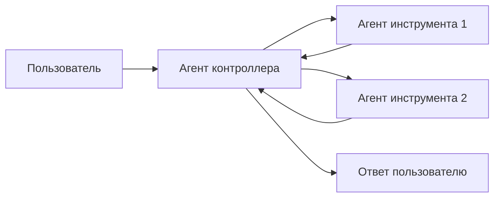
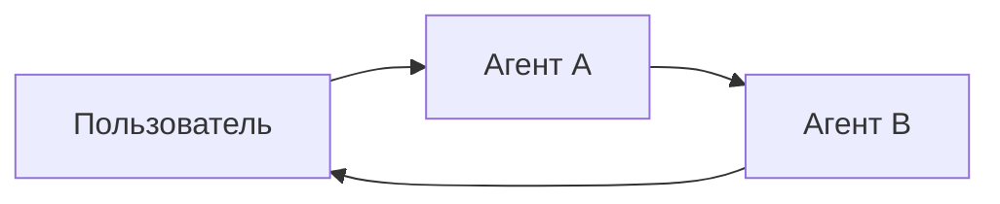

# Мультиагентные системы

**Мультиагентные системы** разбивают сложное приложение на несколько специализированных агентов, которые работают вместе для решения проблем.
Вместо того чтобы полагаться на одного агента для обработки каждого шага, **мультиагентные архитектуры** позволяют вам объединять более мелкие, сфокусированные агенты в согласованную рабочую среду.

Мультиагентные системы полезны, когда:

* У одного агента слишком много инструментов, и он плохо решает, какие из них использовать.
* Контекст или память становятся слишком большими для эффективного отслеживания одним агентом.
* Задачи требуют **специализации** (например, планировщика, исследователя, математического эксперта).

## Паттерны мультиагентных систем

| Паттерн | Как это работает | Поток управления | Пример использования |
| --------------------------------- | ---------------------------------------------------------------------------------------------------------------------------------------------------------------- | ---------------------------------------------------------- | ------------------------------------------------ |
| [**Вызов инструментов**](#вызов-инструментов) | Агент **супервизор** вызывает других агентов как *инструменты*. "Инструментальные" агенты не общаются с пользователем напрямую — они просто выполняют свою задачу и возвращают результаты. | Централизованный: вся маршрутизация проходит через вызывающего агента. | Оркестрация задач, структурированные рабочие процессы. |
| [**Передачи управления**](#передачи-управления) | Текущий агент решает **передать управление** другому агенту. Активный агент меняется, и пользователь может продолжить взаимодействие напрямую с новым агентом. | Децентрализованный: агенты могут менять активность. | Многодоменные разговоры, специализированный захват. |

<Card title="Руководство: Создание агента-супервизора" icon="sitemap" href="/oss/python/langchain/supervisor" arrow cta="Узнать больше">
  Узнайте, как создать персонального помощника, используя паттерн супервизора, где центральный агент-супервизор координирует специализированных рабочих агентов.
  Это руководство демонстрирует:

  * Создание специализированных подагентов для разных доменов (календарь и электронная почта)
  * Обертывание подагентов как инструментов для централизованной оркестрации
  * Добавление проверки человеком в цикле для чувствительных действий
</Card>

## Выбор паттерна

| Вопрос | Вызов инструментов | Передачи управления |
| ----------------------------------------------------- | ------------ | -------- |
| Нужен централизованный контроль над рабочим процессом? | ✅ Да | ❌ Нет |
| Хотите, чтобы агенты взаимодействовали с пользователем напрямую? | ❌ Нет | ✅ Да |
| Сложный, похожий на человеческий разговор между специалистами? | ❌ Ограничен | ✅ Хорошо |

<Tip>
  Вы можете комбинировать оба паттерна — используйте **передачи управления** для переключения агентов, и пусть каждый агент **вызывает подагентов как инструменты** для специализированных задач.
</Tip>

## Настройка контекста агента

В сердце дизайна мультиагентных систем лежит **инженерия контекста** - решение о том, какую информацию видит каждый агент. LangChain дает вам детальный контроль над:

* Какие части разговора или состояния передаются каждому агенту.
* Специализированные подсказки, адаптированные для подагентов.
* Включение/исключение промежуточных рассуждений.
* Настройка форматов ввода/вывода для каждого агента.

Качество вашей системы **сильно зависит** от инженерии контекста. Цель состоит в том, чтобы каждый агент имел доступ к правильным данным, необходимым ему для выполнения своей задачи, будь то действие в качестве инструмента или в качестве активного агента.

## Вызов инструментов

В **вызове инструментов** один агент ("**контроллер**") рассматривает других агентов как *инструменты*, которые вызываются при необходимости. Контроллер управляет оркестрацией, в то время как инструментальные агенты выполняют конкретные задачи и возвращают результаты.

Поток:

1. **Контроллер** получает входные данные и решает, какой инструмент (подагент) вызвать.
2. **Агент инструмента** выполняет свою задачу на основе инструкций контроллера.
3. **Агент инструмента** возвращает результаты контроллеру.
4. **Контроллер** решает следующий шаг или завершает работу.



<Tip>
  От агентов, используемых как инструменты, вообще **не ожидается** продолжение разговора с пользователем.
  Их роль - выполнить задачу и вернуть результаты агенту контроллера.
  Если вам нужны подагенты, способные общаться с пользователем, используйте **передачи управления** вместо этого.
</Tip>

### Реализация

Ниже приведен минимальный пример, в котором главному агенту предоставляется доступ к одному подагенту через определение инструмента:

```python  theme={null}
from langchain.tools import tool
from langchain.agents import create_agent


subagent1 = create_agent(model="...", tools=[...])

@tool(
    "subagent1_name",
    description="subagent1_description"
)
def call_subagent1(query: str):
    result = subagent1.invoke({
        "messages": [{"role": "user", "content": query}]
    })
    return result["messages"][-1].content

agent = create_agent(model="...", tools=[call_subagent1])
```

В этом паттерне:

1. Главный агент вызывает `call_subagent1`, когда решает, что задача соответствует описанию подагента.
2. Подагент выполняется независимо и возвращает свой результат.
3. Главный агент получает результат и продолжает оркестрацию.

### Где настраивать

Есть несколько точек, где вы можете контролировать, как контекст передается между главным агентом и его подагентами:

1. **Имя подагента** (`"subagent1_name"`): Так главный агент ссылается на подагента. Поскольку это влияет на подсказки, выбирайте внимательно.
2. **Описание подагента** (`"subagent1_description"`): Это то, что главный агент "знает" о подагенте. Это напрямую формирует решение главного агента о том, когда его вызывать.
3. **Входные данные для подагента**: Вы можете настроить эти входные данные, чтобы лучше формировать то, как подагент интерпретирует задачи. В примере выше мы передаем сгенерированный агентом `query` напрямую.
4. **Выходные данные от подагента**: Это **ответ**, передаваемый обратно главному агенту. Вы можете настроить то, что возвращается, чтобы контролировать, как главный агент интерпретирует результаты. В примере выше мы возвращаем текст последнего сообщения, но вы можете вернуть дополнительное состояние или метаданные.

### Контроль входных данных для подагента

Есть два основных рычага для контроля входных данных, которые главный агент передает подагенту:

* **Изменить подсказку** – Настройте подсказку главного агента или метаданные инструмента (т.е. имя и описание подагента), чтобы лучше направлять, когда и как он вызывает подагента.
* **Инъекция контекста** – Добавьте входные данные, которые невозможно зафиксировать в статической подсказке (например, полная история сообщений, предыдущие результаты, метаданные задачи), настраивая вызов инструмента для извлечения из состояния агента.

```python  theme={null}
from langchain.agents import AgentState
from langchain.tools import tool, ToolRuntime

class CustomState(AgentState):
    example_state_key: str

@tool(
    "subagent1_name",
    description="subagent1_description"
)
def call_subagent1(query: str, runtime: ToolRuntime[None, CustomState]):
    # Примените любую логику, необходимую для преобразования сообщений во входные данные
    subagent_input = some_logic(query, runtime.state["messages"])
    result = subagent1.invoke({
        "messages": subagent_input,
        # Вы также можете передавать здесь другие ключи состояния по мере необходимости.
        # Убедитесь, что вы определили их в схемах состояния как главного, так и подагента.
        "example_state_key": runtime.state["example_state_key"]
    })
    return result["messages"][-1].content
```

### Контроль выходных данных от подагента

Две распространенные стратегии формирования того, что главный агент получает обратно от подагента:

* **Изменить подсказку** – Уточните подсказку подагента, чтобы точно указать, что должно быть возвращено.
  * Полезно, когда выходные данные неполные, слишком подробные или отсутствуют ключевые детали.
  * Частый режим отказа заключается в том, что подагент выполняет вызовы инструментов или рассуждения, но **не включает результаты** в свое последнее сообщение. Напомните ему, что контроллер (и пользователь) видят только финальный вывод, поэтому вся соответствующая информация должна быть включена туда.
* **Пользовательское форматирование вывода** – настройте или дополните ответ подагента в коде перед тем, как передать его обратно главному агенту.
  * Пример: передайте определенные ключи состояния обратно главному агенту в дополнение к финальному тексту.
  * Для этого требуется обернуть результат в [`Command`](https://reference.langchain.com/python/langgraph/types/#langgraph.types.Command) (или эквивалентную структуру), чтобы вы могли объединить пользовательское состояние с ответом подагента.

```python  theme={null}
from typing import Annotated
from langchain.agents import AgentState
from langchain.tools import InjectedToolCallId
from langgraph.types import Command


@tool(
    "subagent1_name",
    description="subagent1_description"
)
# Нам нужно передать `tool_call_id` подагенту, чтобы он мог использовать его для ответа с результатом вызова инструмента
def call_subagent1(
    query: str,
    tool_call_id: Annotated[str, InjectedToolCallId],
# Вам нужно вернуть объект `Command`, чтобы включить больше, чем просто финальный вызов инструмента
) -> Command:
    result = subagent1.invoke({
        "messages": [{"role": "user", "content": query}]
    })
    return Command(update={
        # Это пример ключа состояния, который мы передаем обратно
        "example_state_key": result["example_state_key"],
        "messages": [
            ToolMessage(
                content=result["messages"][-1].content,
                # Нам нужно включить идентификатор вызова инструмента, чтобы он совпадал с правильным вызовом инструмента
                tool_call_id=tool_call_id
            )
        ]
    })
```

## Передачи управления

В **передачах управления** агенты могут напрямую передавать управление друг другу. "Активный" агент меняется, и пользователь взаимодействует с тем агентом, который в данный момент имеет контроль.

Поток:

1. **Текущий агент** решает, что ему нужна помощь от другого агента.
2. Он передает управление (и состояние) **следующему агенту**.
3. **Новый агент** взаимодействует напрямую с пользователем, пока не решит снова передать управление или завершить работу.



### Реализация (Скоро будет)

***

<Callout icon="pen-to-square" iconType="regular">
  [Отредактировать источник этой страницы на GitHub.](https://github.com/langchain-ai/docs/edit/main/src/oss/langchain/multi-agent.mdx)
</Callout>

<Tip icon="terminal" iconType="regular">
  [Подключите эти документы программно](/use-these-docs) к Claude, VSCode и другим через MCP для получения ответов в реальном времени.
</Tip>


---
> Чтобы найти навигацию и другие страницы в этой документации, загрузите файл llms.txt по адресу: https://docs.langchain.com/llms.txt